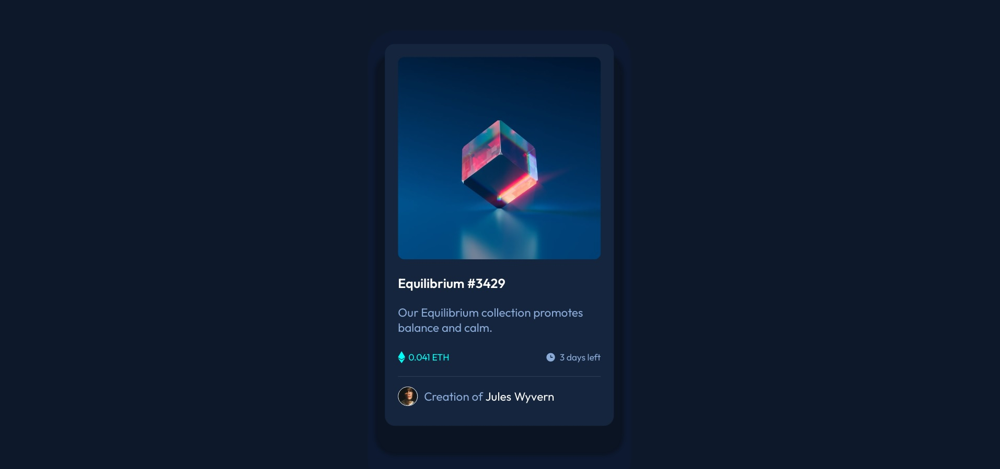

# Frontend Mentor - NFT preview card component solution

This is a solution to the [NFT preview card component challenge on Frontend Mentor](https://www.frontendmentor.io/challenges/nft-preview-card-component-SbdUL_w0U). Frontend Mentor challenges help you improve your coding skills by building realistic projects.

## Table of contents

- [Overview](#overview)
  - [The challenge](#the-challenge)
  - [Screenshot](#screenshot)
  - [Links](#links)
- [My process](#my-process)
  - [Built with](#built-with)
  - [What I learned](#what-i-learned)
- [Author](#author)

**Note: Delete this note and update the table of contents based on what sections you keep.**

## Overview

### The challenge

Users should be able to:

- View the optimal layout depending on their device's screen size
- See hover states for interactive elements

### Screenshot




**Note: Delete this note and the paragraphs above when you add your screenshot. If you prefer not to add a screenshot, feel free to remove this entire section.**

### Links

- Solution URL: [Add solution URL here](https://your-solution-url.com)
- Live Site URL: [Add live site URL here](https://ibrahemnaser.github.io/NFT-Card/index.html)

## My process

### Built with

- Semantic HTML5 markup
- CSS custom properties
- Mobile-first workflow

**Note: These are just examples. Delete this note and replace the list above with your own choices**

### What I learned

This challenge helped learned me how to make an overlay for an image.

To see how you can add code snippets, see below:

```html
<div class="image-box">
  
  <div class="overlay">
    
  </div>
```

## Author

- Website - [Ibrahem Naser](https://ibrahemnaser.github.io/Portfolio/index.html)
- Frontend Mentor - [@ibrahemnaser](https://www.frontendmentor.io/profile/ibrahemnaser)

**Note: Delete this note and add/remove/edit lines above based on what links you'd like to share.**
